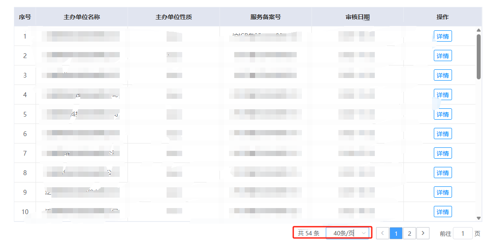
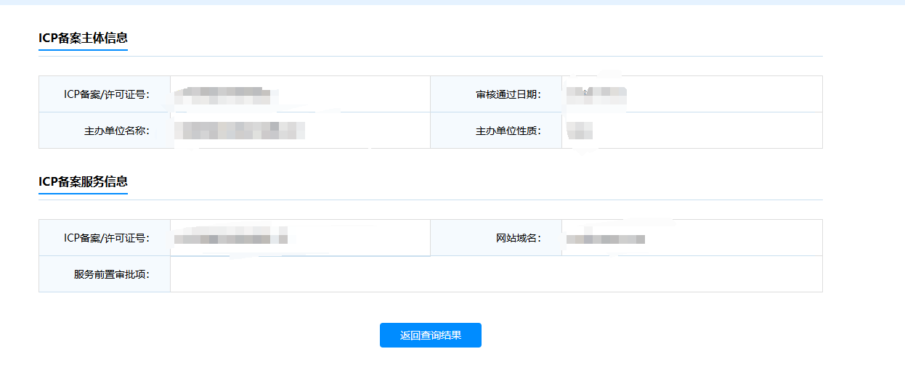
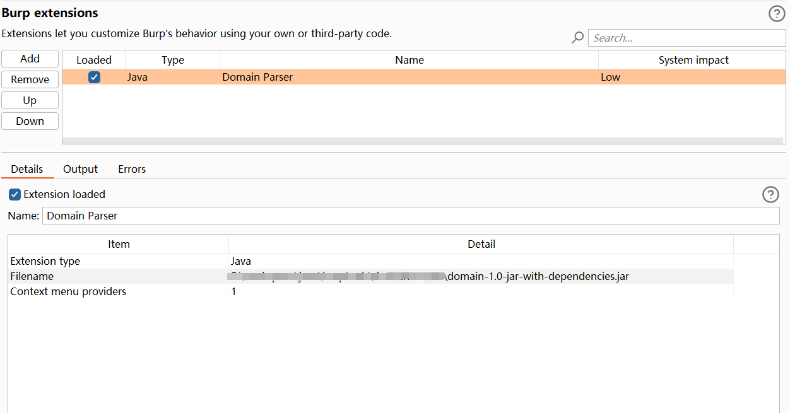
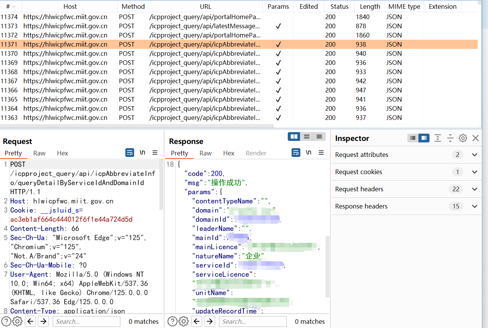
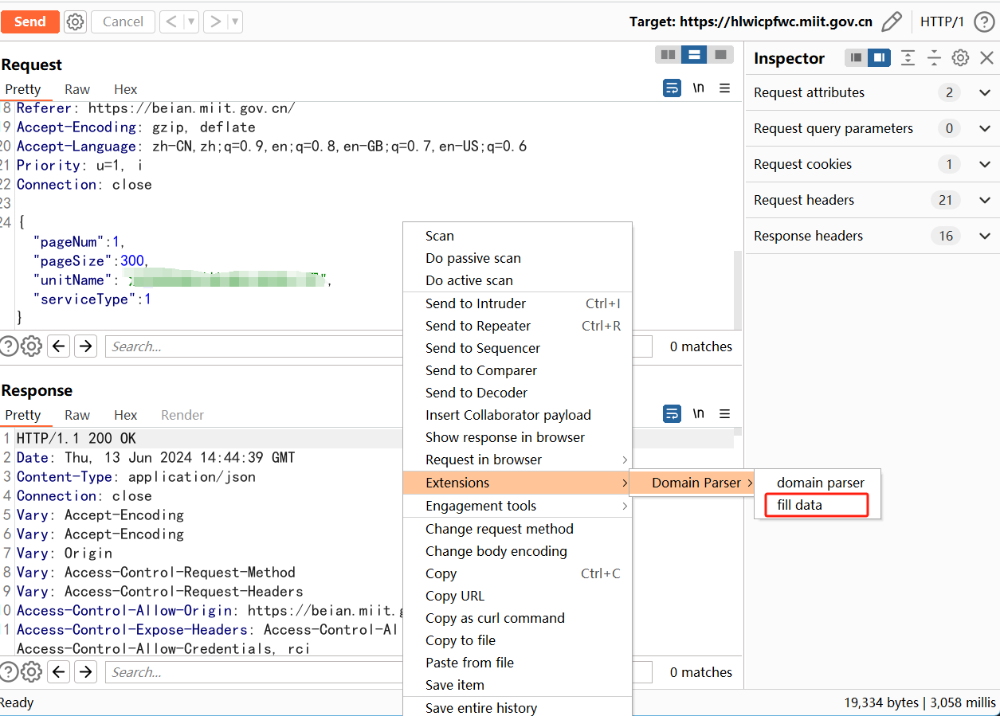
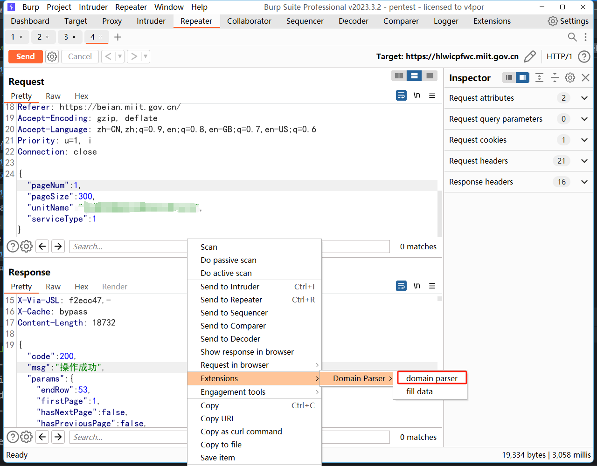
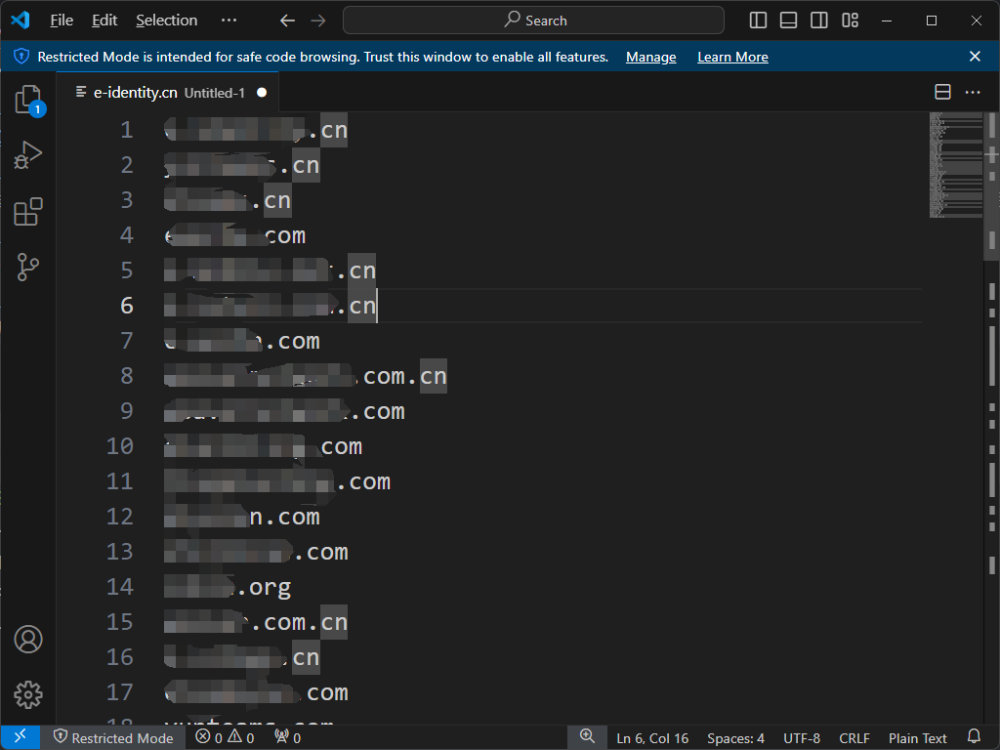

# 介绍
**<神烦>** 在查询公司域名备案号时，一次查询最多只能查40条!!!

**<神烦>** 想看域名得点 [详情] 按钮跳转到下个页面去，看完又要点击按钮调回来!!!

为简化备案域名查询，请立即使用domain插件!!!

# 使用方法
1. burp导入插件

2. [ICP/IP官网](https://beian.miit.gov.cn/#/Integrated/index)查询目标，并使用burp抓包

3. 转发到repeater模块，在request中右键鼠标，选择 Extensions -> Domain Parser -> fill data，然后重放请求

4. 在response中右键鼠标，选择 Extensions -> Domain Parser -> domain parser

5. 解析成功，可以愉快的到处 ctrl v 喽 ~ !<^.^>!

# 后续待办
1. proxy模块中自动识别并标记ICP/IP查询请求包
2. 合并数据填充、手动发包和域名解析
3. ...
