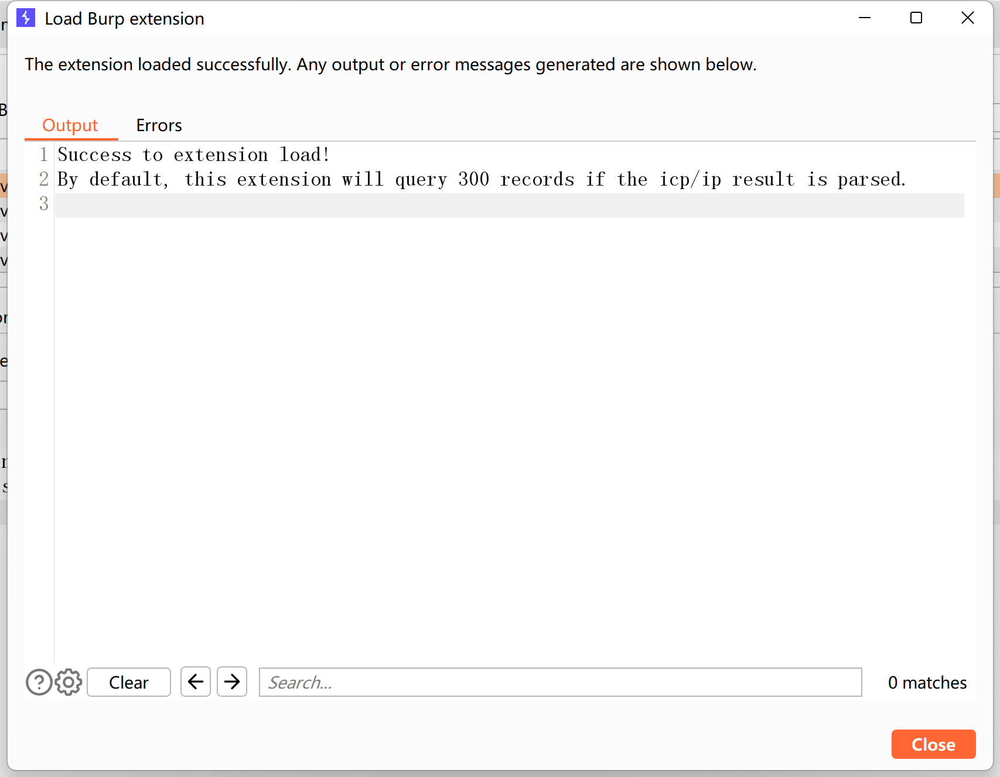
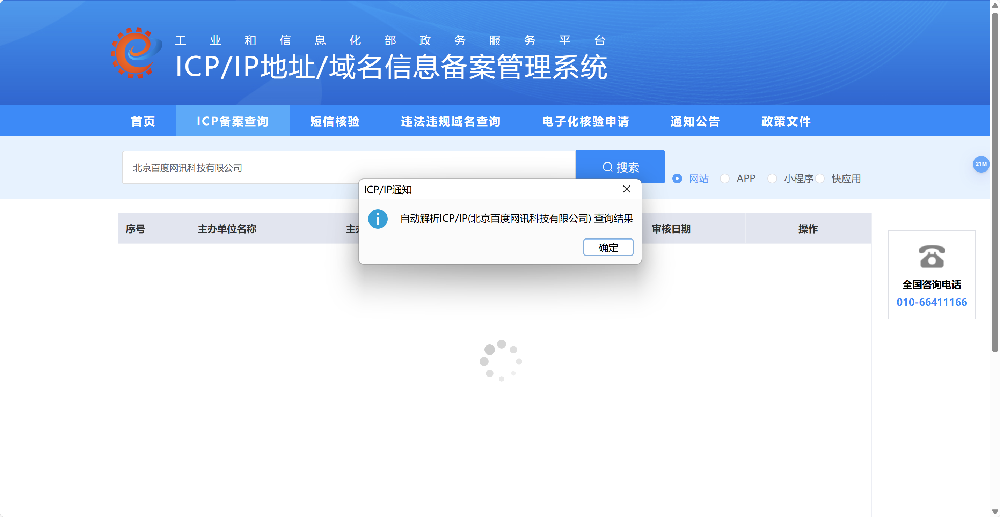
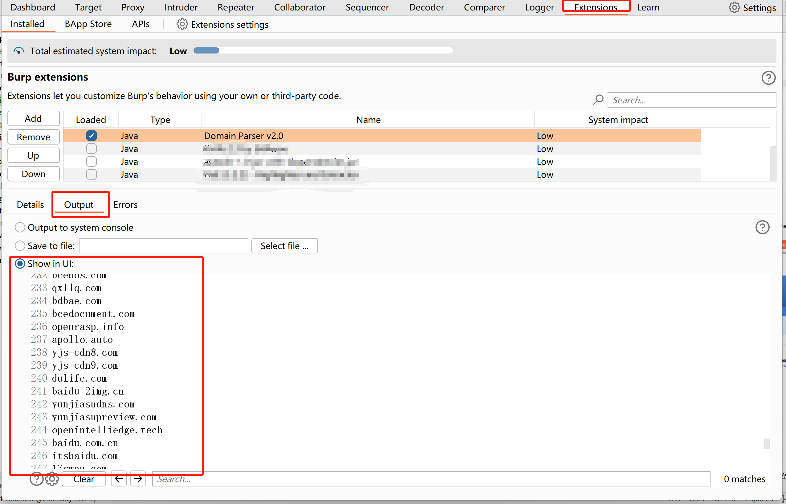

# 介绍
**<神烦>** 在查询公司域名备案号时，一次查询最多只能查40条!!!

**<神烦>** 想看域名得点 [详情] 按钮跳转到下个页面去，看完又要点击按钮调回来!!!

为简化备案域名查询，请立即使用domain插件!!!

# 使用方法
1. 加载插件

2. 在[ICP/IP官网](https://beian.miit.gov.cn/#/Integrated/index)正常查询即可

3. 查询结果:
   1. 自动复制到粘贴板, 可以直接粘贴
   2. 在burp的extensions -> domain parser -> output中可以看到
      